# Componentes del juego

### <mark style="color:green;">**TABLERO**</mark>

El juego incluye el tablero con 9  módulos de doble cara&#x20;

<figure>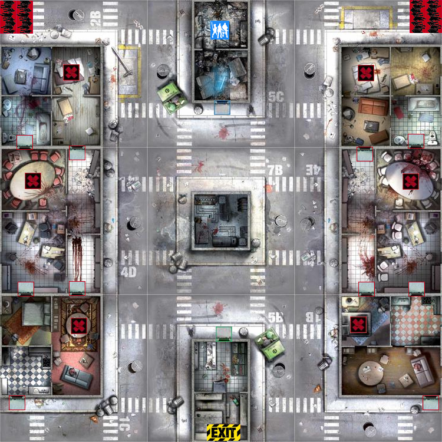<figcaption></figcaption></figure>

### <mark style="color:green;">**PIEZAS**</mark>

#### <mark style="color:yellow;">Supervivientes</mark>

6 SUPERVIVIENTES

<figure>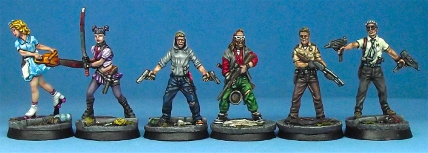<figcaption></figcaption></figure>

#### <mark style="color:yellow;">Corredores</mark>&#x20;

16 CORREDORES

<figure>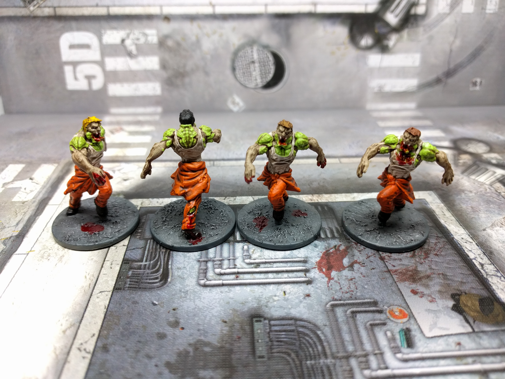<figcaption></figcaption></figure>

#### <mark style="color:yellow;">Caminantes</mark>

40 CAMINANTES

<figure>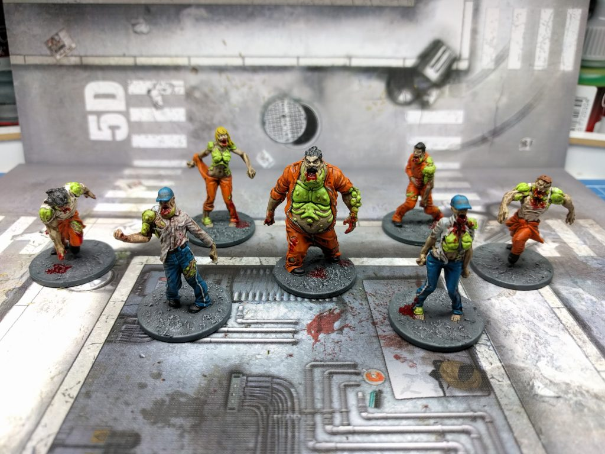<figcaption></figcaption></figure>

#### <mark style="color:yellow;">Gordos</mark>

8 GORDOS&#x20;

<figure>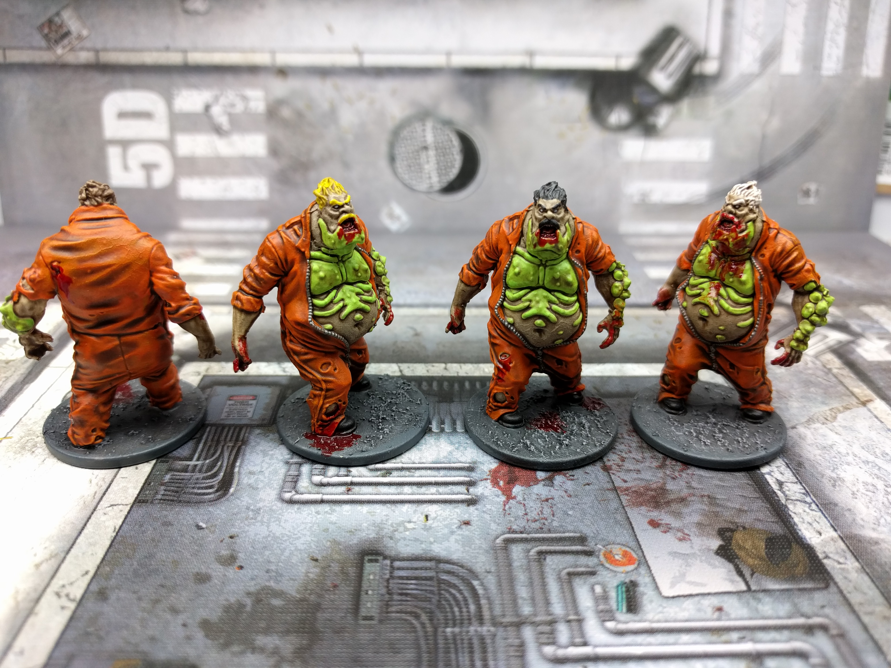<figcaption></figcaption></figure>

#### <mark style="color:yellow;">Abominacion</mark>

1 ABOMINACIÓN

<figure>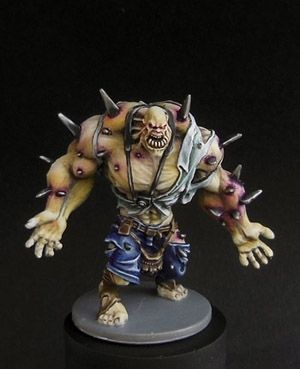<figcaption></figcaption></figure>

### <mark style="color:green;">CARTAS</mark>

42 CARTAS DE ZOMBI&#x20;

62 CARTAS DE EQUIPO&#x20;

6 CARTAS DE HERIDA

<figure>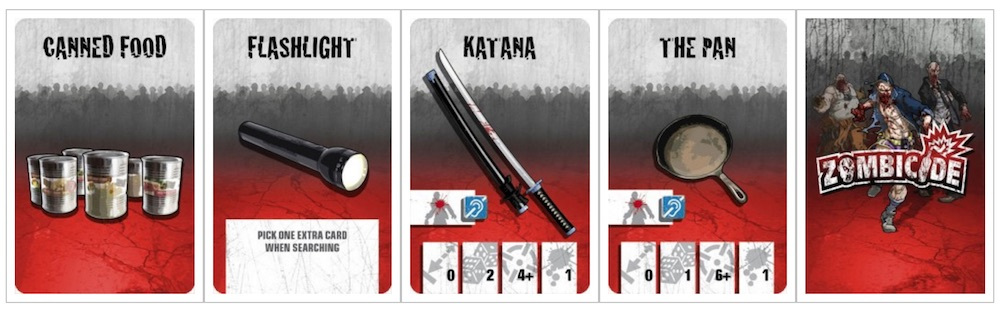<figcaption></figcaption></figure>

 

<figure>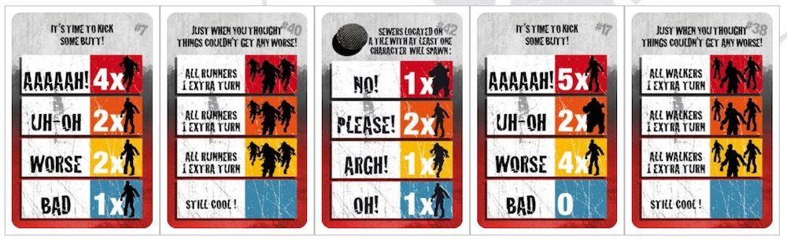<figcaption></figcaption></figure>

### <mark style="color:green;">Tarjetas de identificacion de supervivientes</mark>

6 TARJETAS DE IDENTIFICACION DE SUPERVIVIENTES&#x20;

<figure>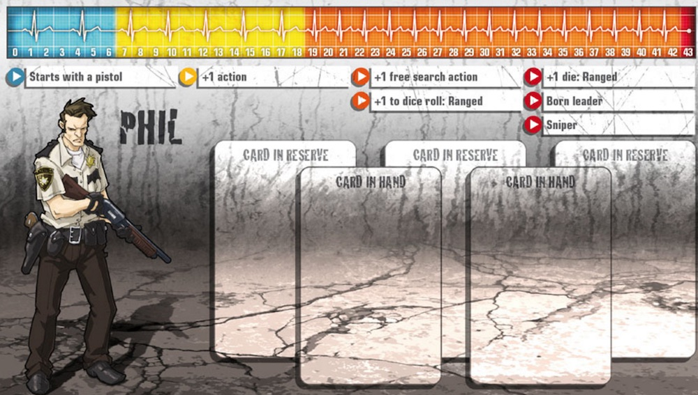<figcaption></figcaption></figure>

 

<figure>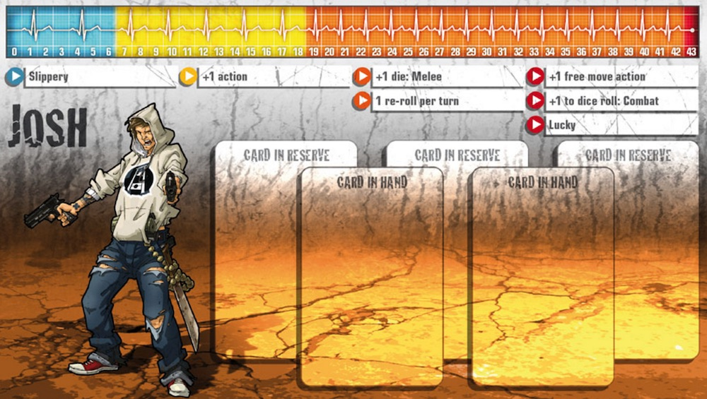<figcaption></figcaption></figure>

 

<figure>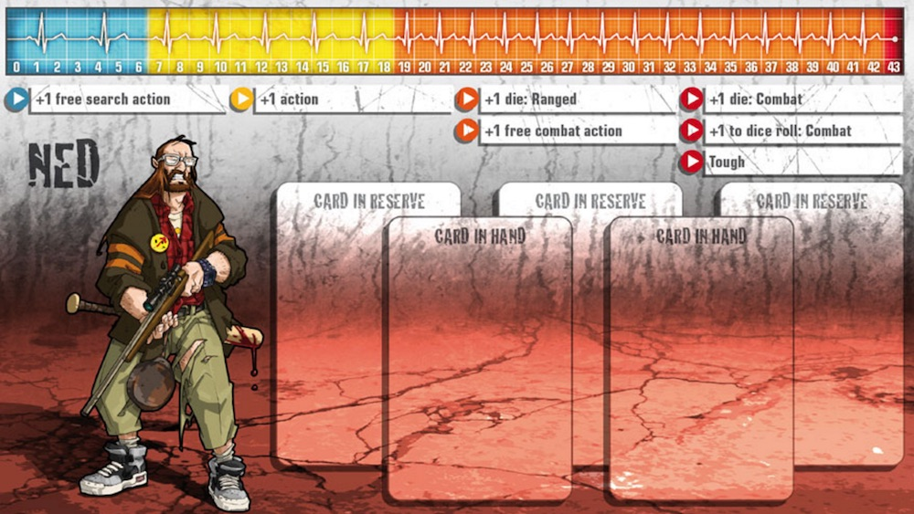<figcaption></figcaption></figure>

### <mark style="color:green;">OTRAS FICHAS</mark>&#x20;

#### <mark style="color:yellow;">6 DADOS</mark>

<figure>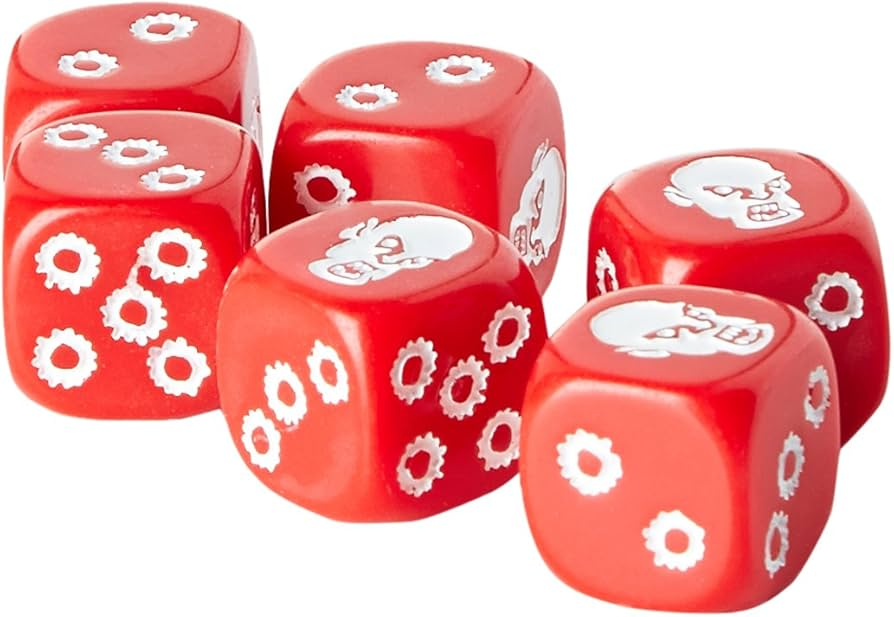<figcaption></figcaption></figure>

#### <mark style="color:yellow;">4 FICHAS DE COCHE</mark>

<figure>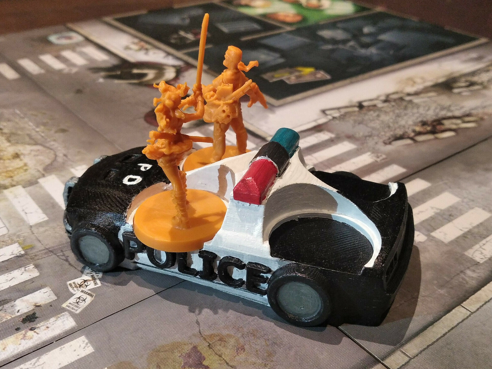<figcaption></figcaption></figure>

#### <mark style="color:yellow;">24 CONTADORES DE  AVANCE</mark>

<figure><figcaption></figcaption></figure>
