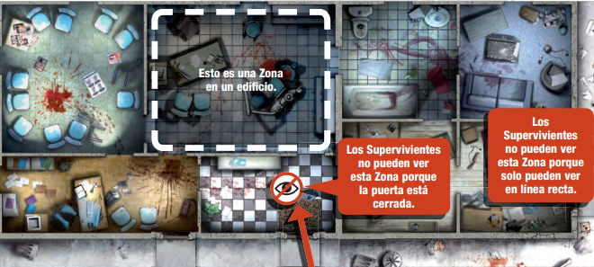

# Definiciones útiles

### _Básicos_

> Un actor puede ser un **superviviente** o un **zombi**

***

### _Zonas_

Dentro de un **edificio**, una Zona es una habitación.&#x20;

**En la calle,** una Zona es la parte entre dos pasos de peatones y las paredes de los edificios de dicha calle. Una Zona puede extenderse a lo largo de dos módulos, e incluso cuatro.

### _Visión_

**Dentro de un edificio**, un Actor ve todas las Zonas que compartan una abertura con la Zona en la que se encuentra este. No obstante, su campo de visión está limitado a una distancia de una Zona. Si hay una abertura, las paredes no bloquean la línea de visión entre dos Zonas.

<figure><figcaption></figcaption></figure>

**En las calles**, los Actores ven en líneas rectas paralelas a los bordes del tablero de juego. Los Actores no pueden ver en diagonal. Su campo de visión cubre todas las Zonas que pueda cruzar la línea antes de alcanzar una pared o el borde del tablero de juego.

<figure><figcaption></figcaption></figure>

***

### _Tipos de Zombis_

| Caracteristicas        | Gordo                                                                    | Corredor                                                                 | Abominacion                                                                         | Caminante                                                                |
| ---------------------- | ------------------------------------------------------------------------ | ------------------------------------------------------------------------ | ----------------------------------------------------------------------------------- | ------------------------------------------------------------------------ |
| Arma apropiada         | Solo las que tengan mas de 1 de daño                                     | Todas                                                                    | Solo las que tengan mas de 2 de daño o un coctel molotov                            | Todas                                                                    |
| _Experiencia Obtenida_ | 1 punto                                                                  | 1 punto                                                                  | 5 puntos                                                                            | 1 punto                                                                  |
| Habilidades            | Grandes, hinchados y duros, estos zombis son difíciles de tumbar         | Movimiento doble de rápido que un caminante                              | La Abominación aparece sola (posiblemente tras comerse a sus compañeros Caminantes) | Apesta, es asqueroso y es lento                                          |
| Aspecto                |  |  |             |  |

***

### _Movimiento_

<figure><figcaption></figcaption></figure>

Los **actores** pueden moverse entre **Zonas** si estas comparten un borde, excluyendo movimientos diagonales. En las **calles**, no hay restricciones de movimiento entre **Zonas**. Para pasar de un edificio a las calles o viceversa, deben cruzar una puerta. Dentro de los **edificios**, el movimiento entre **Zonas** es posible si están conectadas por una abertura, ignorando las paredes entre ellas

### Armas

<table><thead><tr><th>Estados</th><th>Definicion</th><th data-hidden></th></tr></thead><tbody><tr><td></td><td>Las piezas de Equipo que te permiten abrir puertas tienen este símbolo</td><td></td></tr><tr><td></td><td>Las piezas de Equipo que te permiten matar zombis tienen este símbolo.</td><td></td></tr><tr><td></td><td>Las piezas de Equipo que tienen este símbolo producen una ficha de Ruido.</td><td></td></tr><tr><td></td><td>Las piezas de Equipo que tienen este símbolo son silenciosas y no producen fi chas de Ruido.</td><td></td></tr></tbody></table>

***

### Barra de peligro y experiencia

Un Superviviente gana experiencia al matar zombis y al cumplir ciertos objetivos, como eliminar a una Abominación. Hay cuatro Niveles de peligro: Azul, Amarillo, Naranja y Rojo, que indican el aumento en la cantidad de zombis.

* **Nivel Amarillo**: se alcanza con 7 puntos de experiencia y otorga una cuarta acción permanente.
* **Nivel Naranja**: se activa con 19 puntos y permite elegir entre dos Habilidades.
* **Nivel Rojo**: se alcanza con 44 puntos y permite elegir entre tres Habilidades.
