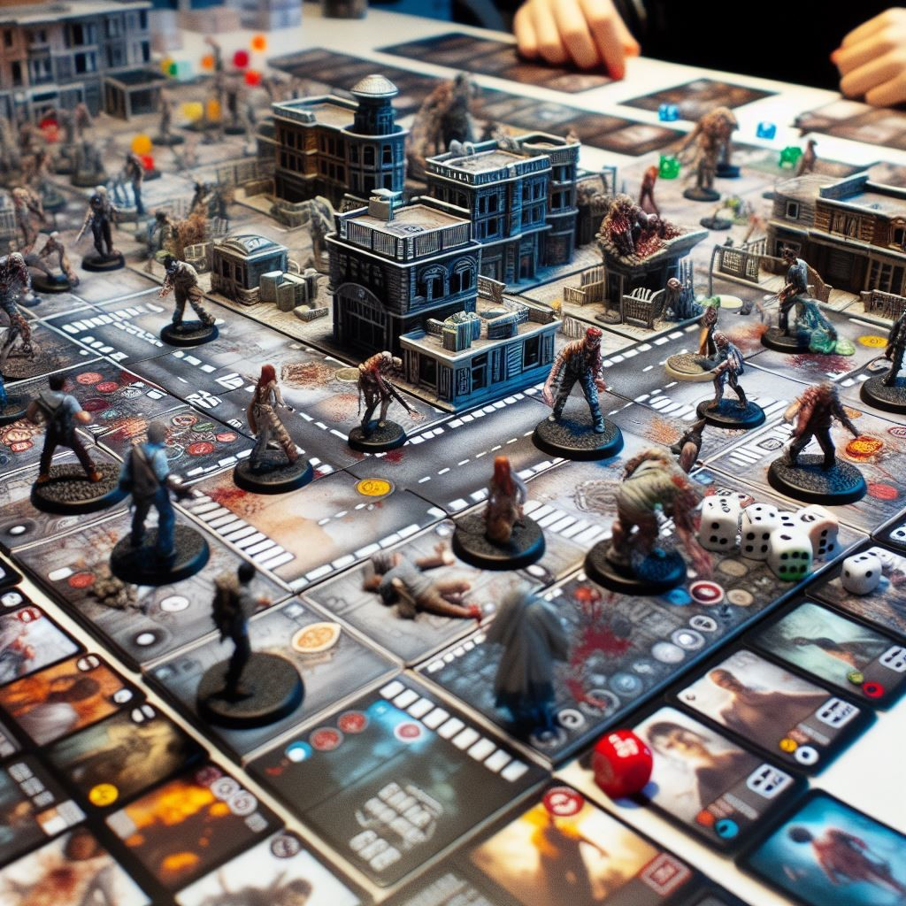

# Sobrevive y gana

&#x20;\-En Zombicide, juegas junto a compañeros contra hordas de zombis controladas por el propio juego.Los supervivientes matan zombis con cualquier cosa de la que puedan echar mano.

<figure><figcaption></figcaption></figure>

\-Cada jugador maneja entre 1 y 4 supervivientes, con el objetivo de sobrevivir y completar las misiones.

&#x20;\-Los supervivientes se enfrentan a los zombis con las armas que van encontrando, y puedes intercambiar equipo o incluso sacrificarte por otros.&#x20;

\-Solo la cooperación te permitirá alcanzar los objetivos de cada misión, en las misiones, deberás rescatar supervivientes, eliminar zombis, encontrar comida y más
